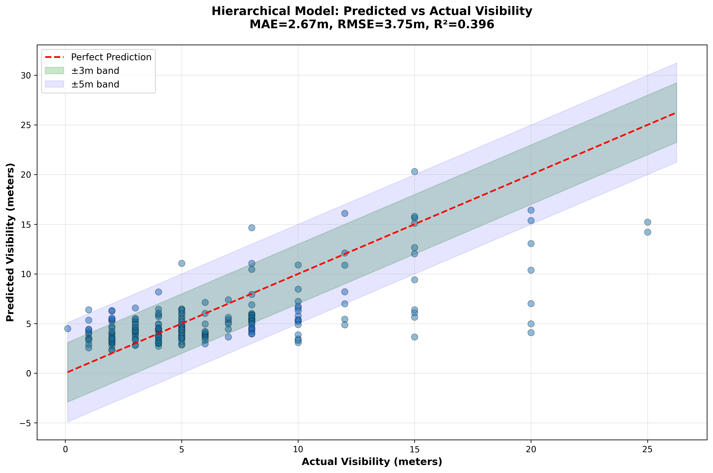
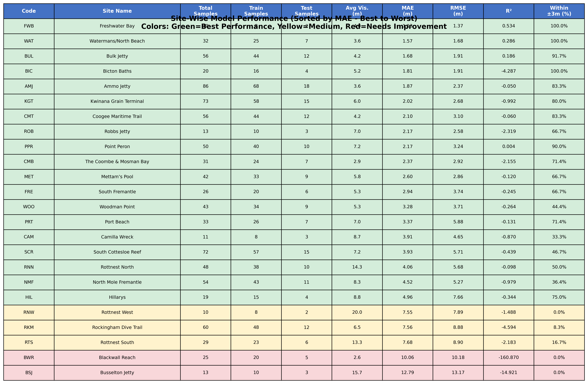

# 🌊 Underwater Visibility Prediction Model

A hierarchical Bayesian model for predicting underwater visibility at Western Australian dive sites based on weather and oceanographic conditions.

[](https://www.python.org/downloads/)
[](https://opensource.org/licenses/MIT)

## 🎯 Model Performance

- **MAE**: 2.67 meters
- **RMSE**: 3.75 meters
- **R² Score**: 0.3961 (~40% variance explained)
- **Accuracy**: 69.79% within ±3m, 80.73% within ±4m

## 📁 Repository Structure

```
visibility_prediction_pipeline/
│
├── README.md                          # This file
├── requirements.txt                   # Python dependencies
├── .gitignore                        # Git ignore rules
│
├── models/                           # 🎯 Trained Model Files
│   ├── stormglass_pymc_hierarchical_extended_idata.nc
│   ├── stormglass_pymc_hierarchical_extended_scaler.pkl
│   ├── stormglass_pymc_hierarchical_extended_predictors.pkl
│   ├── stormglass_pymc_hierarchical_extended_coefficient_summary.csv
│   └── site_performance_metrics.csv
│
├── stormglass_output/                # 📊 Dataset
│   └── daily_rolling_averages.csv   # 999 records, 24 sites
│
├── plots/                            # 📈 Visualizations
│   ├── predicted_vs_actual_visibility.png
│   └── site_performance_table.png
│
├── predict_visibility.py             # 🚀 Prediction Script (USE THIS)
├── stormglass_pymc_hierarchical_extended.py  # 🔧 Training Script
├── site_coordinates.json             # 📍 Site GPS Coordinates
│
└── docs/                             # 📚 Documentation
    ├── MODEL_README.md               # Detailed model documentation
    └── MODEL_PACKAGE_MANIFEST.md     # Distribution guide
```

## 🚀 Quick Start

### 1. Clone the Repository

```bash
git clone https://github.com/your-username/visibility-prediction.git
cd visibility-prediction
```

### 2. Install Dependencies

```bash
pip install -r requirements.txt
```

### 3. Make Predictions

```python
from predict_visibility import VisibilityPredictor

# Load the trained model
predictor = VisibilityPredictor(model_dir='models')

# Load your weather data
import pandas as pd
data = pd.read_csv('your_weather_data.csv')

# Predict visibility for Ammo Jetty
predictions = predictor.predict(data, site_code='AMJ')

print(f"Predicted visibility: {predictions[0]:.1f} meters")
```

### 4. Command Line Usage

```bash
python predict_visibility.py --input weather_data.csv --output predictions.csv --site AMJ
```

## 📊 Dataset

**File**: `stormglass_output/daily_rolling_averages.csv`

- **Records**: 999 visibility reports
- **Sites**: 24 dive sites across Western Australia
- **Features**: 71 columns including:
  - Weather data (temperature, wind, precipitation, pressure, cloud cover)
  - Oceanographic data (wave height, swell, water temperature)
  - Rolling averages (2-day, 3-day, 4-day windows)
  - Temporal features (seasonal patterns)

### Supported Dive Sites

| Code | Site Name | Avg Visibility | Best/Worst |
|------|-----------|----------------|------------|
| FWB | Freshwater Bay | 4.0m | ⭐ Best (MAE: 1.13m) |
| WAT | Watermans/North Beach | 3.6m | ⭐ Best (MAE: 1.57m) |
| AMJ | Ammo Jetty | 3.6m | Good (MAE: 1.87m) |
| ... | ... | ... | ... |
| BSJ | Busselton Jetty | 15.7m | ⚠️ Challenging (MAE: 12.79m) |
| BWR | Blackwall Reach | 2.6m | ⚠️ Challenging (MAE: 10.06m) |

*See `models/site_performance_metrics.csv` for complete list*

## 🔧 Training Your Own Model

If you want to retrain the model with new data:

```bash
python stormglass_pymc_hierarchical_extended.py
```

**Training Details:**
- **Method**: Hierarchical Bayesian (PyMC + NUTS sampler)
- **Duration**: ~3-5 minutes
- **Chains**: 2 chains × 2,000 samples
- **Convergence**: 0 divergences (excellent)

## 📈 Model Features

### Top Predictive Features

1. **Seasonal Patterns** (month_cos): -0.17 coefficient
2. **Swell Height** (2-4 day rolling): -0.11 (higher swell = lower visibility)
3. **Wave Height** (2-4 day rolling): +0.07 to +0.08
4. **Precipitation** (24-48h): -0.04 to -0.03 (rain reduces visibility)

### Model Architecture

- **Type**: Hierarchical Bayesian with site-specific random effects
- **Global Parameters**: 30 weather/oceanographic features
- **Site Effects**: 24 location-specific adjustments
- **Output**: Visibility prediction in meters

## 📚 Documentation

- **[MODEL_README.md](docs/MODEL_README.md)** - Complete technical documentation
- **[MODEL_PACKAGE_MANIFEST.md](docs/MODEL_PACKAGE_MANIFEST.md)** - Distribution guide

## 🔬 Use Cases

1. **Dive Planning** - Predict visibility before heading out
2. **Research** - Analyze visibility patterns across sites/seasons
3. **Conservation** - Monitor water clarity trends
4. **Weather Analysis** - Understand environmental impacts on visibility

## 📦 Required Packages

```
pandas>=2.0.0
numpy>=1.26.0,<2.0.0
scikit-learn>=1.3.0
pymc>=5.0.0
arviz>=0.17.0
matplotlib>=3.7.0
seaborn>=0.12.0
```

## 🤝 Contributing

We welcome contributions! To add new data or improve the model:

1. Fork the repository
2. Create a feature branch (`git checkout -b feature/new-sites`)
3. Commit your changes (`git commit -am 'Add new dive sites'`)
4. Push to the branch (`git push origin feature/new-sites`)
5. Create a Pull Request

## 📄 License

This project is licensed under the MIT License - see the LICENSE file for details.

## 🙏 Acknowledgments

- **Data Sources**: 
  - Diver visibility reports from Western Australian dive community
  - Weather/oceanographic data from StormGlass API
- **Framework**: PyMC (Bayesian modeling), scikit-learn, pandas
- **Sites**: 24 dive locations across Western Australia

## 📧 Contact

For questions, issues, or collaboration:
- Open an issue on GitHub
- Email: [your-email@example.com]

## 📊 Performance Visualizations

### Predicted vs Actual Visibility


### Site Performance Comparison


---

**Last Updated**: December 1, 2025  
**Model Version**: hierarchical_extended_v1  
**Python**: 3.11+

⭐ **Star this repo if you find it useful!**

